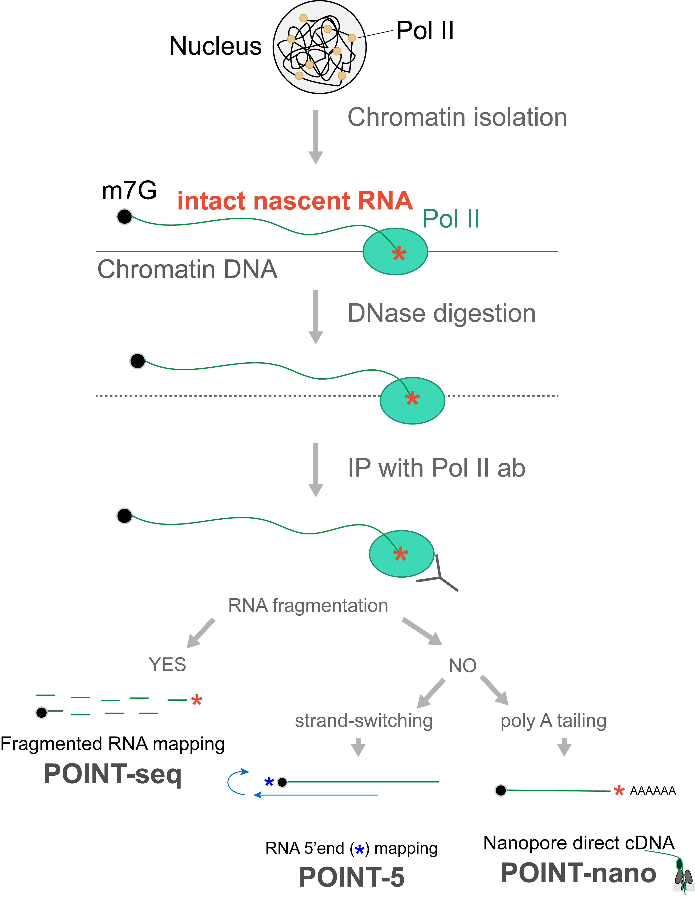

# POINT Technology

Demonstration of bioinformatics pipelines of POINT technology analysis on RNA Polymerase-associated intact nascent  transcripts. This three-pronged methodology maps nascent RNA 5′ ends (**POINT-5**), establishes the kinetics of co-transcriptional splicing patterns (**POINT-nano**), and profiles whole transcription units (**POINT-seq**). 

## Install necessary packages

To analyse POINT data the following software are required:

- FastQC (v0.11.9)
- TrimGalore! (v0.6.7)
- Cutadapt (v4.0)
- STAR (v2.7.10a)
- Bedtools (v2.30.0)
- Samtools (v1.15.1)
- Python (v3.8.10)
- Pysam (v0.19.0)

In linux-based systems this can be easily acomplished with `conda create` function over the `environment.yml` file.

`conda create --name POINT_Protocol --file environment.yml -c conda-forge -c bioconda`

## POINT bioinformatic pipelines

This repository is split in 4 directories: 1 for each POINT library preparation (POINT-seq, POINT-5 and POINT-nano); an extra directory contains a python-based pipeline to obtain gene/transcript/exon/intron reference annotations in humans (Ensembl v90).

Each directory of POINT technology contains all the necessary scripts to perform the processing and visualization of the data, and a jupyter notebook with a step-by-step bioinformatic protocol with the necessay commands and expected outputs.

## Further details on the POINT technology & Citations

- Our first publication in [Molecular Cell](https://doi.org/10.1016/j.molcel.2021.02.034) of the POINT technology and its aplications.
    
    Rui Sousa-Luís, Gwendal Dujardin, Inna Zukher, Hiroshi Kimura, Carika Weldon, Maria Carmo-Fonseca, Nick J. Proudfoot, Takayuki Nojima, ***POINT technology illuminates the processing of polymerase-associated intact nascent transcripts***, **Molecular Cell**, Volume 81, Issue 9, 2021, 1935-1950.e6, https://doi.org/10.1016/j.molcel.2021.02.034.
    
    
